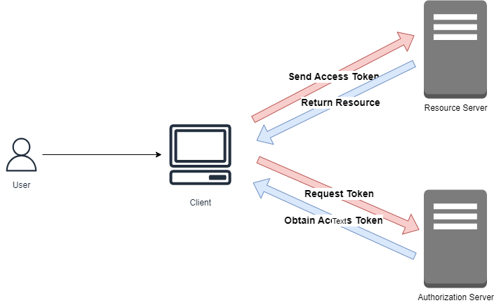

# SPRING OAUTH AUTHORIZATION SERVER, RESOURCE SERVER AND OAUTH CLIENT
A simple oauth authorization server, resource server and an oauth client server

## WORKFLOW
[Authorization Server](https://docs.spring.io/spring-authorization-server/reference/overview.html)  
[OAuth Client](https://docs.spring.io/spring-security/reference/reactive/oauth2/client/index.html)  
[Resource Server](https://docs.spring.io/spring-security/reference/reactive/oauth2/resource-server/index.html)  



## OAUTH SERVER
A Spring OAuth Server (Authorization Server) is responsible for handling OAuth 2.0 authentication and authorization processes in a Spring-based application.  
It provides endpoints to issue access tokens and manage OAuth 2.0 flows like authorization code flow, client credentials flow, etc.  

### OAUTH SERVER DISCOVERY ENDPOINT
- OpenID providers publish their metadata at a well-known URL which looks like this:
```
http://localhost:8080/.well-known/openid-configuration
```
- The OpenID server also publishes the same metadata at the well-known URL for plain OAuth 2.0 authorisation servers:
```
http://localhost:8080/.well-known/oauth-authorization-server
```

### CONFIGURATION
To allow OAuth clients to register with an OAuth server, the OAuth server should include the following properties:
```
spring.security.oauth2.authorizationserver.client.demo-client.registration.authorization-grant-types=client_credentials, authorization_code, refresh_token
spring.security.oauth2.authorizationserver.client.demo-client.registration.client-authentication-methods=client_secret_basic
spring.security.oauth2.authorizationserver.client.demo-client.registration.client-id=demo
spring.security.oauth2.authorizationserver.client.demo-client.registration.client-secret="{noop}secret"
# registrationId = reg-client
spring.security.oauth2.authorizationserver.client.demo-client.registration.redirect-uris=http://127.0.0.1:8082:8082/login/oauth2/code/reg-client
spring.security.oauth2.authorizationserver.client.demo-client.registration.scopes=user.read, user.write, openid
spring.security.oauth2.authorizationserver.client.demo-client.require-authorization-consent=true
```

## RESOURCE SERVER
A Spring Resource Server is a service that hosts protected resources, such as APIs, and enforces OAuth 2.0 authorization by validating the access tokens issued by an OAuth Server (Authorization Server).  
The Resource Server typically receives requests from clients and validates the access token that accompanies each request to determine whether access should be granted.

### CONFIGURATION
Configuration of resource server
```
spring.security.oauth2.resourceserver.jwt.issuer-uri=http://localhost:8080
```

## OAUTH CLIENT
A Spring OAuth Client is an application or service that interacts with an OAuth Authorization Server to request access to protected resources on behalf of a user.  
The client handles the OAuth 2.0 flow to obtain access tokens from the Authorization Server and then uses these tokens to access resources on the Resource Server.

### CONFIGURATION
Configuration of oauth-client
```
spring.security.oauth2.client.provider.spring.issuer-uri=http://localhost:8080
# registrationId = reg-client
spring.security.oauth2.client.registration.reg-client.authorization-grant-type=authorization_code
spring.security.oauth2.client.registration.reg-client.client-authentication-method=client_secret_basic
spring.security.oauth2.client.registration.reg-client.client-id=demo
spring.security.oauth2.client.registration.reg-client.client-secret=secret
spring.security.oauth2.client.registration.reg-client.provider=spring
spring.security.oauth2.client.registration.reg-client.scope=user.read, openid
```

## USAGE
- Run:
  - spring-oauth-server
  - spring-resource-server
  - spring-oauth-client 
- Oauth-server username - `user` and password - `password`
- You are required to use `http://127.0.0.1:8082` to access oauth client endpoints, `http://localhost:8082` wouldn't work as a result of cookies
- Example: `http://127.0.0.1:8082/message`
  - With the example above, the user is redirected to the oauth server, after authentication, user is authorized to get resource from the resource server.

## RESOURCES
- [Authorization Server](https://docs.spring.io/spring-authorization-server/reference/overview.html)
- [OAuth2 Login](https://docs.spring.io/spring-security/reference/reactive/oauth2/login/index.html)
- [OAuth2 Client](https://docs.spring.io/spring-security/reference/reactive/oauth2/client/index.html)
- [Resource Server](https://docs.spring.io/spring-security/reference/reactive/oauth2/resource-server/index.html)
- [OAuth 2.0 Playground](https://www.oauth.com/playground/)
- [Learn OAuth 2.0](https://www.oauth.com/)
- [OAuth 2.0 General Documentation](https://oauth.net/2/)
- [OAuth 2.0 Authorization Framework](https://datatracker.ietf.org/doc/html/rfc6749)
